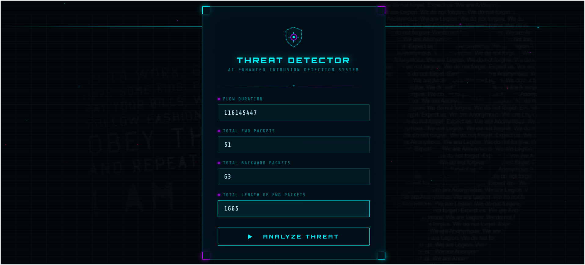
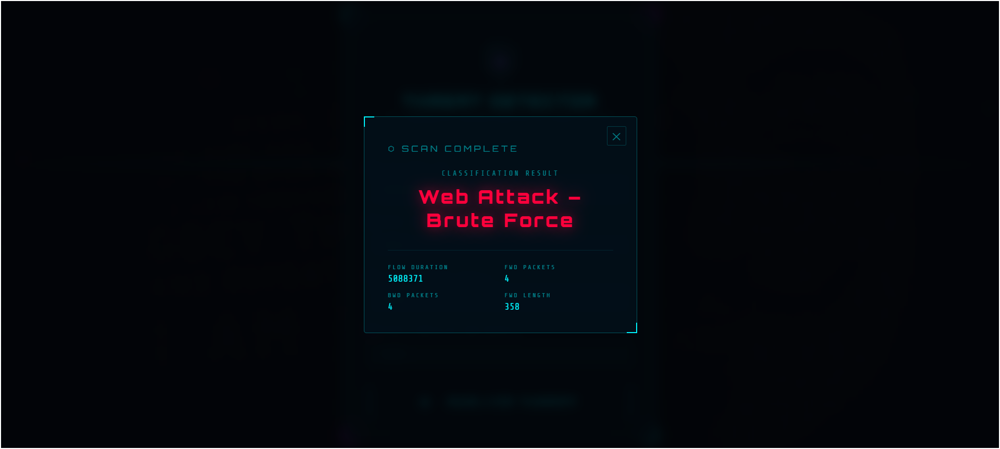

<div align="center">

# 🛡️ Cyber Security — AI Enhanced Intrusion Detection System


**A full-stack AI-powered web application that detects web-based network attacks in real time using a trained Random Forest machine learning model — wrapped in a modern cyberpunk-themed animated UI.**

</div>

---

## 📸 Screenshots

| Main Page | Prediction Result |
|:---------:|:-----------------:|
|  |  |

---

## 📌 What This Project Does

This system takes **4 network traffic features** as input from the user through a web form and instantly predicts whether the traffic is:

- ✅ **BENIGN** — Normal, safe network traffic
- 🚨 **ATTACK** — Malicious / web attack traffic detected

It uses a pre-trained **Random Forest ML model** deployed via a **Flask** web application. The UI is styled with a dark cyberpunk hacker theme, animated scan lines, glowing neon effects, floating particles, and a dynamic loading screen.

---

## 📁 Project Structure

```
CYBER-SECURITY-AI-ENHANCED-INTRUSION-DETECTION-SYSTEM/
│
├── .venv/                                        # Virtual environment
│   ├── Include/
│   ├── Lib/
│   └── Scripts/
│
├── CYBER_PROJECT/                                # Main project folder
│   ├── templates/
│   │   └── index.html                           # Cyberpunk web UI (Jinja2 template)
│   ├── app.py                                   # Flask backend — routes & prediction logic
│   ├── random_forest_model_4_features.joblib    # Pre-trained Random Forest model
│   ├── Untitled.ipynb                           # Jupyter Notebook — EDA & model training
│   └── web_attacks_balanced.csv                 # Balanced network traffic dataset
│
├── Screenshots/
│   ├── mainpage.png                             # Screenshot of the main input page
│   └── predicationpage.png                      # Screenshot of the prediction result
│
├── venv/                                        # Virtual environment (alternate)
├── .gitignore                                   # Git ignored files
├── pyvenv.cfg                                   # Python venv config
└── README.md                                    # This file
```

---

## 🛠️ Technology Stack

| Category | Tool / Library | Purpose |
|---|---|---|
| **Language** | Python 3.x | Core programming language |
| **Web Framework** | Flask | Backend server & routing |
| **ML Library** | scikit-learn | Random Forest model training & prediction |
| **Data Balancing** | imbalanced-learn | Balance attack vs normal traffic classes |
| **Data Processing** | Pandas, NumPy | Data loading, cleaning, feature extraction |
| **Model Saving** | Joblib | Serialize and load the trained ML model |
| **Frontend** | HTML5, CSS3, JavaScript | Web interface design |
| **Templating** | Jinja2 (Flask) | Dynamic HTML rendering |
| **Notebook** | Jupyter Notebook | EDA, training, and evaluation |
| **Version Control** | Git & GitHub | Source code management |

---

## 🧠 Machine Learning Details

### Model: Random Forest Classifier

The model is stored as `random_forest_model_4_features.joblib` and is loaded directly in `app.py` using:

```python
from joblib import load
model = load("random_forest_model_4_features.joblib")
```

### Input Features (exactly 4)

| # | Feature Name | Form Field Name | Description |
|---|---|---|---|
| 1 | Flow Duration | `flow_duration` | Total duration of the network flow in microseconds |
| 2 | Total Fwd Packets | `total_fwd_packets` | Number of packets sent in the forward direction |
| 3 | Total Backward Packets | `total_backward_packets` | Number of packets sent in the backward direction |
| 4 | Total Length of Fwd Packets | `total_length_fwd_packets` | Total byte size of all forward packets |

### Output Classes

| Prediction | Meaning |
|---|---|
| `BENIGN` | ✅ Normal network traffic — no threat detected |
| `ATTACK` | 🚨 Malicious traffic — web attack detected |

### Why Random Forest?

- Handles **non-linear relationships** between network traffic features
- **Resistant to overfitting** — uses averaging across many decision trees
- **High accuracy** on balanced numerical datasets
- **Fast prediction** — ideal for real-time web deployment
- Requires **no heavy feature engineering**

---

## 🚀 How to Run the Project

### ✅ Prerequisites

- Python 3.x installed on your system
- VS Code (recommended editor)

### Step-by-Step Setup

**1. Open the project in VS Code**
```
File → Open Folder → select the project root folder
```

**2. Open the terminal**
```
Terminal → New Terminal   (Ctrl + `)
```

**3. Activate the virtual environment**

> Windows:
```bash
.venv\Scripts\activate
```
> Mac / Linux:
```bash
source .venv/bin/activate
```

**4. Install required libraries**
```bash
pip install flask numpy joblib scikit-learn imbalanced-learn pandas
```

**5. Navigate into the CYBER_PROJECT folder**
```bash
cd CYBER_PROJECT
```

**6. Run the Flask app**
```bash
python app.py
```

**7. Open in your browser**
```
http://127.0.0.1:5000
```

---

## 🖥️ How to Use the Web App

Once the app is running, open the browser and:

1. Enter the **4 network traffic values** in the form fields
2. Click the **"Analyze Threat"** button
3. A loading animation will appear while the model processes the input
4. The **Prediction Result modal** will pop up showing:
   - The classification result (`BENIGN` or `ATTACK`)
   - A summary of the values you entered

### Sample Input Values to Test

| Field | Sample Value |
|---|---|
| Flow Duration | `100000` |
| Total Fwd Packets | `10` |
| Total Backward Packets | `5` |
| Total Length of Fwd Packets | `2000` |

---

## 🎨 UI Features

The frontend (`templates/index.html`) is a fully custom-built cyberpunk-themed interface:

| Feature | Description |
|---|---|
| 🎬 Background Video | Looping hacker-style video behind the form |
| 🔲 Animated Grid | Scrolling dot grid overlay for depth |
| 📡 Scan Line Beam | Horizontal glowing beam sweeping the screen |
| ✨ Floating Particles | 30 neon particles floating upward |
| 🖥️ Glassmorphism Card | Dark translucent card with neon corner brackets |
| 💡 Input Indicators | Pulsing colored dot on each label |
| 🟢 Submit Button | Slide-fill animation on hover |
| ⏳ Loader Overlay | Dual counter-rotating rings + progress bar |
| 📊 Result Modal | 3D scale pop-in animation with input summary |

---

## ⚠️ Common Errors & Fixes

| Error Message | Cause | Fix |
|---|---|---|
| `ModuleNotFoundError: No module named 'flask'` | Flask not installed | Run `pip install flask` |
| `FileNotFoundError: random_forest_model...` | Wrong working directory | Run `cd CYBER_PROJECT` first |
| `venv\Scripts\activate` not recognized | PowerShell execution policy | Run `Set-ExecutionPolicy RemoteSigned -Scope CurrentUser` |
| `KeyboardInterrupt` during venv creation | Network timeout | Run `python -m venv venv --without-pip` |
| Port 5000 already in use | Another app using port | Run `python app.py` with `app.run(port=5001)` |

---

## ✅ Advantages

- Real-time prediction with instant results through the browser
- High classification accuracy using ensemble Random Forest model
- Balanced training data ensures fair detection of both classes
- Simple, intuitive web interface — no technical knowledge needed
- Lightweight Flask backend — runs on any Python environment
- Fully self-contained project with pre-trained model included

## ❌ Limitations

- Only 4 input features — manual entry required (no live packet capture)
- Model must be retrained when new attack patterns emerge
- Restricted to attack types present in the training dataset
- No user authentication or multi-user support

---

## 🔭 Future Scope

- 🔴 **Live packet capture** using Scapy to auto-populate input fields
- 📊 **Real-time dashboard** showing traffic trends and attack history
- ☁️ **Cloud deployment** on AWS / Heroku / Render for public access
- 🧠 **Deep learning models** (LSTM/CNN) for better attack pattern recognition
- 📱 **Mobile interface** using React Native or Flutter
- 🔔 **Email/SMS alerts** when an attack is detected
- 🔐 **User login system** for access control and history trackinggit ad

<div align="center">


</div>
